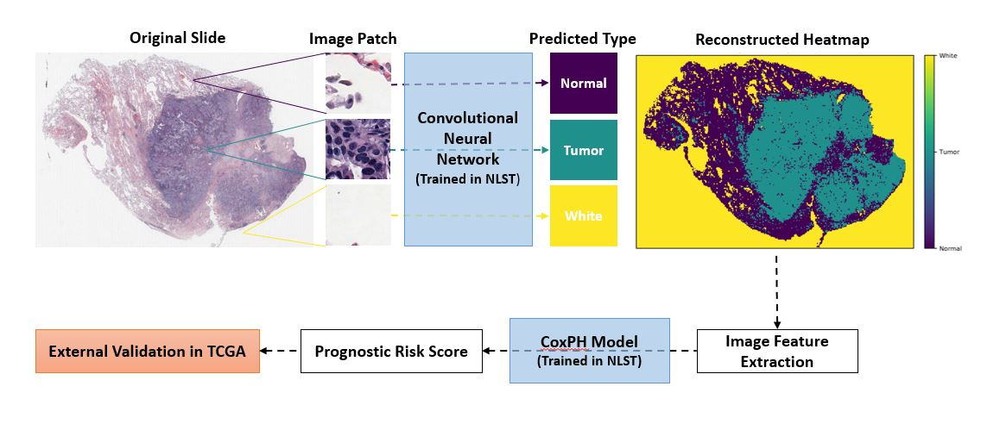
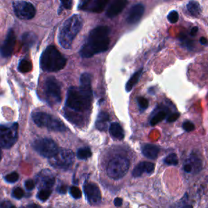
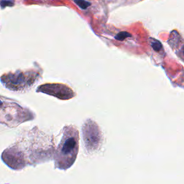
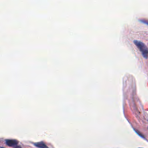

# Comprehensive analysis of lung cancer pathology images

Author: Shidan Wang, [QBRC](https://qbrc.swmed.edu/)

Scripts for https://www.nature.com/articles/s41598-018-27707-4, _Comprehensive analysis of lung cancer pathology images to discover tumor shape and boundary features that predict survival outcome_.

## Citation 

Wang, S., Chen, A., Yang, L., Cai, L., Xie, Y., Fujimoto, J., ... & Xiao, G. (2018). Comprehensive analysis of lung cancer pathology images to discover tumor shape features that predict survival outcome. bioRxiv, 274332.

## This repository includes

* A scripts folder
* An README file
* Pathology images that support the findings of this study are available online in [NLST](https://biometry.nci.nih.gov/cdas/nlst/) and [The Cancer Genome Atlas Lung Adenocarcinoma (TCGA-LUAD)](https://wiki.cancerimagingarchive.net/display/Public/TCGA-LUAD).

## Requirements

* Python 2
* keras==2.0.5
* tensorflow==1.2.1
* Other commonly used python libraries

* R
* survival==2.41-3

## The pipeline

### 1) Annotate slides

[Aperio Imagescope](https://www.leicabiosystems.com/digital-pathology/manage/aperio-imagescope/) is used to annotate the pathology slides (.svs files) and generate the corresponding .xml files. "Tumor" and "normal" regions are circled out from which the training set image patches are extracted.

### 2) Generate patches

In total, 2475 ROI, 2139 Normal, and 730 White patches were generated. One can easily generate more training/testing samples by running `./scripts/1_generatePatches.py`. Below is a sample ROI, normal, and white patch, respectively.

  

### 3) Train InceptionV3 model

